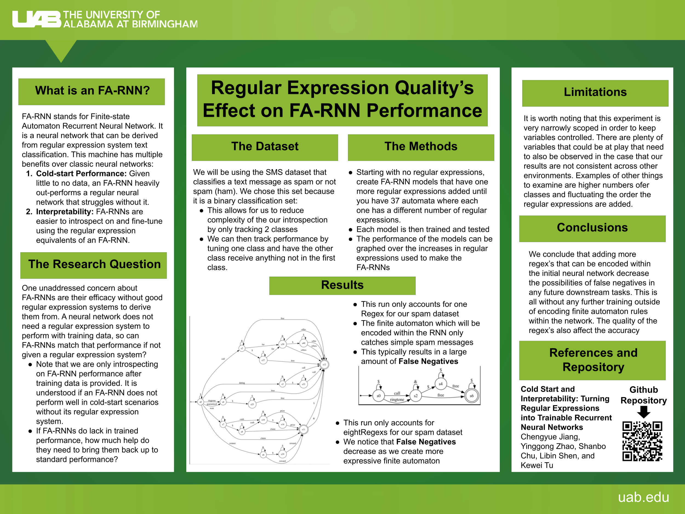

# FA-RNN

CS662 Final Project by Michael Gathara and Akshar Patel
(The commits are a little skewed as we worked on this project in person on one computer)



We have setup a script for anyone interested in our contributions to this project. 
The initial project was created by:
```
@inproceedings{jiang-etal-2020-cold,
    title = "Cold-start and Interpretability: Turning Regular Expressions into Trainable Recurrent Neural Networks",
    author = "Jiang, Chengyue  and
      Zhao, Yinggong  and
      Chu, Shanbo  and
      Shen, Libin  and
      Tu, Kewei",
    booktitle = "Proceedings of the 2020 Conference on Empirical Methods in Natural Language Processing (EMNLP)",
    month = nov,
    year = "2020",
    address = "Online",
    publisher = "Association for Computational Linguistics",
    url = "https://www.aclweb.org/anthology/2020.emnlp-main.258",
    pages = "3193--3207",
}
```

Our contributions include those highlighted within the poster, which is, testing how different finite automataon (or regular expressions) affect the cold start, zero shot, accuracy of the FARNN. 

# Running

We have set this project up to make running it as simple as possible. There is only one file to run, but before you do. Make sure you have Conda and Python installed, both come pre-installed on Cheaha. 
* First, clone the repo
```bash
git clone https://github.com/Michaelgathara/FA-RNN
```
* Load Anaconda on Cheaha
```bash
module load Anaconda3
```
* Cheaha's Python version should be Python 3.9+ (This project requires at minimum Python 3.9)
* Create a conda environment and activate it
```bash
conda create -n <envname>
conda activate <envname>
```
* The development team is anti-conda, thus we use pip and requirements.txt
* Allow conda to use pip
```bash
conda config --set pip_interop_enabled True
```
* Navigate to the project directory
```bash
cd fa_rnn_code/
```
* Install the requirements.txt, this will include all packages you need to run this program. 
```bash
pip install -r requirements.txt
```
* Navigate to `src`
```bash
cd src
```
* Run the `script.py` file
```bash
python3 script.py
```

The results will be dumped into a `results/` folder, while the last ran automata will be dumped into `data/SMS/automata`. Images of the confusion matrix will be dumped into `results/images`. The results of the program are typical training/testing output, thus reading them will be looking for accuracy as it trains and tests.

